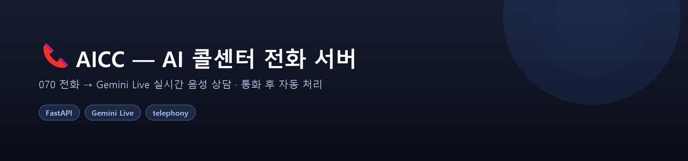
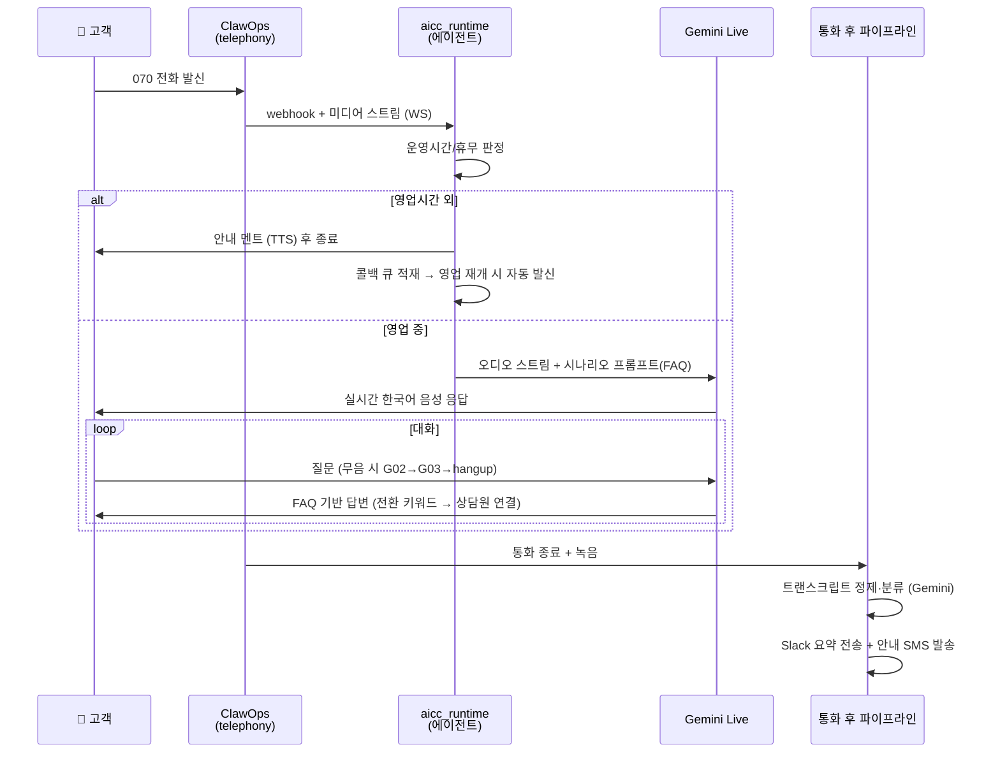

<p align="center">
  
</p>

<div align="center">

# 📞 AICC — AI 콜센터 전화 서버

**070 번호로 걸려온 실제 전화를 Gemini Live가 한국어 음성으로 상담하고, 통화 후 분류·요약·SMS까지 자동 처리하는 AI Contact Center 서버**


</div>

> **🔒 데이터 거버넌스** — 포트폴리오 공개를 위해 실제 운영 정보를 모두 제거했습니다.
> 브랜드는 가상의 **"마음케어"**로, 전화번호·Slack 채널은 자리표시자로 치환했고,
> 운영 시나리오 문서는 목업 데이터(`aicc_scenario_sample.xlsx`)로 재작성했습니다.
> 시크릿은 코드에 없으며 전부 `.env` 환경변수로 주입됩니다 (`.env.example` 참고).

---

## 1. 무엇을 하나

고객이 070 번호로 전화하면 —

- **실시간 AI 음성 상담** — ClawOps telephony로 통화를 받아 **Gemini Live**가 한국어로 응대. FAQ 시나리오(xlsx)가 시스템 프롬프트에 주입됨
- **운영시간/휴무 게이트** — 영업시간 외 통화는 안내 후 종료 + **자동 콜백 큐**에 적재, 영업 재개 시 순서대로 발신
- **무음 감지 에스컬레이션** — 무응답 시 재안내(G02) → 종료 안내(G03) → 자동 hangup
- **상담원 전환** — 전환/불만 키워드 또는 AI 응답 실패 누적 시 사람에게 연결
- **통화 후 파이프라인** — 녹음 저장 → Gemini로 트랜스크립트 정제 + 통화 유형 분류 → **Slack 요약 전송** → 고객에게 **안내 SMS/알림톡** 발송
- **CS팀 관리 대시보드** (`/admin/aicc`) — 운영시간·키워드·TTS 멘트를 웹에서 수정하면 **재시작 없이 다음 통화부터 즉시 반영** (핫스왑)

## 2. 통화 흐름



## 3. 빠른 시작

```bash
uv sync                # 또는: pip install -e .
cp .env.example .env   # CLAWOPS_* / GOOGLE_API_KEY / SLACK_BOT_TOKEN 등 입력
python run.py
```

기동 후:
- 관리 대시보드: `http://localhost:8000/admin/aicc`
- 상태 점검: `http://localhost:8000/daemon/aicc-status`
- 발신 테스트 페이지: `http://localhost:8000/playground`

실제 전화 송수신에는 ClawOps 계정과 070 번호가 필요합니다. 계정 없이도 서버 기동, 대시보드,
시나리오 로더, 콜백 큐/통화 로그 DB는 동작합니다.

## 4. 구조

```
aicc-voice-agent/
├── run.py                         # 진입점: 웹서버 + 전화 에이전트를 한 asyncio 루프에서 기동
├── aicc_scenario_sample.xlsx      # 목업 시나리오 (G-code 멘트 8종 + FAQ 8건)
├── .env.example                   # 환경변수 템플릿
└── app/
    ├── aicc_runtime.py            # ★ 전화 에이전트 런타임 (운영시간 게이트, 무음 타이머, 에스컬레이션)
    ├── config/settings.py         # pydantic-settings 최소 설정 (.env 로드)
    ├── cc_tools/phone/            # 전화 발신 MCP 도구 (Claude Agent SDK)
    └── cc_web_interface/
        ├── server.py              # FastAPI 앱 팩토리
        ├── voice_chat/            # ClawOps 웹훅/미디어 WS + Gemini Live 브리지
        ├── playground/            # "이 번호로 전화 걸기" 테스트 페이지
        ├── admin_aicc/            # 대시보드 백엔드
        │   ├── config.py          #   설정 저장, 운영시간/키워드 판정, system_prompt 빌드
        │   ├── scenario_loader.py #   xlsx → G-code 멘트 + FAQ 텍스트
        │   ├── agent_control.py   #   핫스왑 (재시작 없이 설정 반영)
        │   ├── call_log_db.py / callback_db.py      # SQLite
        │   ├── callback_dispatcher.py               # 부재중 자동 콜백 발신
        │   ├── call_classifier.py                   # 통화 분류 + 트랜스크립트 정제 (Gemini)
        │   └── sms_sender.py                        # 사후 SMS/알림톡 (SOLAPI / NCP SENS)
        └── static/                # 대시보드 · 플레이그라운드 UI (단일 HTML)
```

데이터 저장: `FILESYSTEM_BASE_DIR`(미설정 시 `~/.aicc`) 아래 `db/`(SQLite), `aicc_recordings/`(통화 녹음).

## 5. 설계 포인트

- **핫스왑 설정** — 대시보드에서 저장한 운영시간·키워드·멘트가 파일로 영속화되고, 다음 통화의 시스템 프롬프트에 즉시 반영. 배포 없이 CS팀이 직접 운영
- **시나리오의 단일 원천** — 비개발자가 관리하는 xlsx(기본흐름 G-code + FAQ)를 `scenario_loader`가 파싱해 TTS 멘트와 프롬프트를 구성. 운영 경로(`~/.aicc/aicc_scenario.xlsx`) → repo 샘플 순으로 폴백
- **통화 후 비동기 파이프라인** — 녹음/분류/Slack/SMS가 통화 응답 경로와 분리돼 상담 지연에 영향 없음
- **시크릿 제로 하드코딩** — 모든 키는 `.env`, 발신번호·Slack 채널도 환경변수

| 외부 서비스 | 용도 | 필수 |
|---|---|:---:|
| ClawOps | 070 수신/발신, 미디어 스트림 | ✅ |
| Gemini Live (`google-genai`) | 실시간 음성 응답 + 트랜스크립트 정제/분류 | ✅ |
| Claude (`claude-agent-sdk`) | 전화 도구 호출 (아웃바운드 목적 통화) | 선택 |
| Slack (`slack-sdk`) | 통화 요약/녹음 전송 | 선택 |
| SOLAPI / NCP SENS | 사후 안내 SMS·알림톡 | 선택 |

## 6. 검증 상태

- 전체 모듈 import + `create_app()` 라우트 배선 확인
- `scenario_loader`가 목업 xlsx에서 G-code 8종 + FAQ 8건 파싱 확인
- 실제 전화 송수신은 ClawOps 계정 키 필요 (운영 환경에서 검증됨, 이 저장소 상태로는 미검증)

---

<sub>이 저장소는 포트폴리오 열람용입니다. 실무 프로젝트에서 고객사·운영 정보를 제거하고
가상 브랜드와 목업 시나리오로 재구성했습니다.</sub>

---

<!-- portfolio-footer -->

### 🗂️ 포트폴리오

이 저장소는 포트폴리오의 일부입니다. → **[전체 프로젝트 보기](https://github.com/asj000221-debug)**

- [MOCO — AI Coworker Platform](https://github.com/asj000221-debug/moco-ai-coworker)
- [근감소증 예측 멀티모달 ML](https://github.com/asj000221-debug/sarcopenia-multimodal-ml)
- [DTx 인지훈련 난이도 조정 봇](https://github.com/asj000221-debug/dtx-adaptive-training-bot)
- [한국어 난독증 읽기평가 엔진](https://github.com/asj000221-debug/korean-reading-assessment)
- **AICC 음성 상담 서버** ← 현재 저장소
